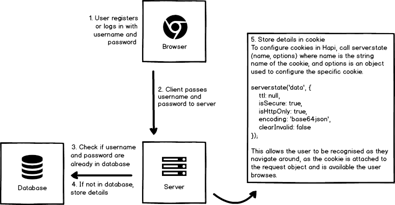
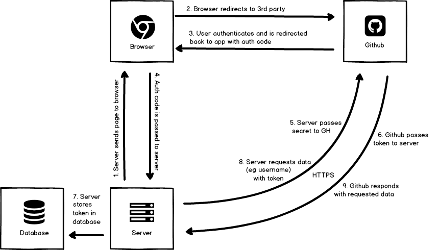

# Authentication flow charts

## Authentication by cookie
Following is a diagram that shows the process by which a cookie can be set, authorising a user to access routes that are available to those logged in.

## OAuth flow
This diagram shows the flow of authentication by OAuth  

